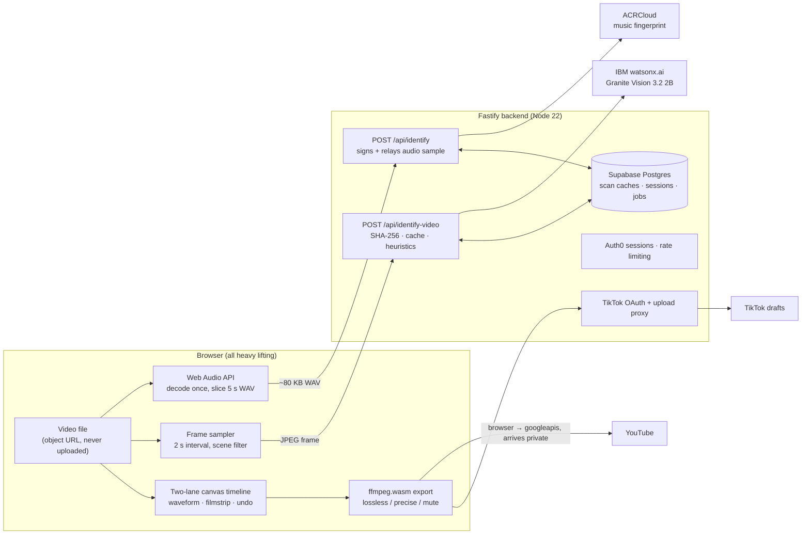

<div align="center">

<!-- Drop the banner from your logo folder into docs/assets/ and uncomment:

-->

# ClaimGuard AI

### Scan videos for copyright before you post. Fix flagged seconds in-browser, publish claim-free.

**Every platform runs copyright detection *after* you upload. ClaimGuard runs it *before*,
on both the soundtrack and the picture, then hands you the editor to fix exactly what it found.**

[](TODO-PUBLIC-VIDEO-LINK)

[](package.json)
[](package.json)
[](server/package.json)
[](#built-with-ibm)

*Built for the **AI Builders Challenge with IBM Bob**, July 2026: Reimagine Creative
Industries with AI. Designed, written, debugged and documented through **IBM Bob**;
see [How IBM Bob built this](#how-ibm-bob-built-this).*

</div>

---

## At a glance

|  |  |
|--|--|
| **What** | A browser-based pre-flight check and video editor. Drop in a video; ClaimGuard fingerprints the soundtrack against a licensed music catalogue, has **IBM Granite Vision** inspect the frames for third-party footage, paints every risky second onto a two-lane timeline, and lets you cut, mute or re-time those exact sections before export. |
| **Who it's for** | Short-form creators, the people with the least leverage in the copyright system. Half of them earn under $15,000 a year; a claim during a video's launch window is money they never get back. |
| **Two detection arms** | **Audio**: ACRCloud acoustic fingerprinting names the actual track, artist, album and confidence. **Visual**: a heuristic pre-pass plus IBM Granite Vision 3.2 flags likely third-party footage (film or TV, broadcast, screen recordings, game footage) as candidates for human review. |
| **The fix is inline** | Detection proposes; the creator disposes. Every flag can be trimmed, split, toggled to keep, or deleted, in the same screen, on a full timeline editor with waveform, filmstrip, snapping and undo. |
| **Privacy by architecture** | The full video is never uploaded. Only 5-second, ~80 KB mono audio samples and downscaled thumbnail frames leave the browser, and solely to be matched. Editing and export run entirely client-side in ffmpeg.wasm. |
| **Honest by design** | Flags are labelled *"Possible copyright: candidate for human review, not a legal determination."* The tool estimates claim risk; it does not adjudicate fair use. |
| **Built with** | IBM Granite Vision 3.2 2B on watsonx.ai · IBM Bob · ACRCloud · Next.js 16 · React 19 · Fastify 5 · Supabase · Auth0 · ffmpeg.wasm |

**Try it with zero credentials:** the app ships with a full mock demo mode (the default).
`npm install && npm run dev`, drop in any video, and watch the complete scan-to-export flow
on fixture data.

---

## The problem

Copyright enforcement on video platforms happens **after** you upload, at a scale no
individual creator can reason about.

| | |
|---|---|
| Content ID claims processed by YouTube in 2025 | **2,502,941,368** (+14% YoY) |
| Share of those claims disputed by uploaders | **0.51%** |
| Uploader win rate on disputes actually filed | **67.4%**, and 75% on appeal |
| Ad revenue redirected to rightsholders via Content ID | **>$12 billion** cumulative |
| Creators earning under $15,000 a year | **~50%** |

Read those rows together. Two and a half billion claims land every year; almost nobody
disputes them; and **two out of three of the people who do dispute turn out to be right.**
That gap is money quietly leaving creators' pockets, not because they were wrong, but
because a claim arrives during the launch window, when most of a video's lifetime views
happen, and fighting it costs time and legal confidence that a creator earning under
$15k a year does not have.

The tooling asymmetry is total. Rightsholders and platforms have Content ID, Pex and
Audible Magic. **The creator has nothing on their side of the transaction**: no way to
know, before hitting publish, which seconds of their edit are going to be claimed.

ClaimGuard closes that gap. It moves detection to *before* upload, where the fix is
still a 30-second edit instead of a dispute.

## What ClaimGuard does

1. **Upload.** Drag a video onto the page. It is loaded as an object URL in your browser
   and never uploaded to our server.
2. **Scan the soundtrack.** The Web Audio API decodes the file once, slices it into
   5-second mono 8 kHz WAV samples (~80 KB each), and each sample is fingerprinted
   against ACRCloud's licensed music catalogue through a signing proxy. Consecutive
   matches of the same track are fused into one region, and ACRCloud's per-sample
   offsets (`sample_begin_time_offset_ms`) refine the region's edges to real timestamps
   rather than 5-second grid lines.
3. **Scan the picture.** After the audio pass, frames are sampled every 2 seconds
   (a luma-histogram scene filter skips near-identical frames), downscaled, and sent to
   the backend, where a synchronous heuristic pass (letterboxing, aspect-ratio
   anomalies) and **IBM Granite Vision 3.2 2B** on watsonx.ai classify each frame
   against a closed nine-category taxonomy: film or TV, sports broadcast, news
   broadcast, music video, video game, screen recording, social media repost,
   advertisement, other third-party. Consecutive frames of the same category merge into
   one span, with two-miss hysteresis so a single odd frame cannot split a region.
4. **Review.** Audio flags appear as red regions on the audio lane, each naming the
   track, artist, album and match confidence. Visual flags appear as purple regions on
   the video lane, each carrying its category, confidence, the signals that fired, and
   the model's reasoning, all human-readable, all labelled as candidates for review.
5. **Edit.** Split, trim, toggle or delete regions; cut either lane at the playhead;
   drag clips freely, trim their edges, silence them, adjust per-clip volume; undo and
   redo throughout.
6. **Export.** Three audio strategies, all in-browser via ffmpeg.wasm:
   * **Cut, lossless**: kept segments are extracted with `-c copy` and joined with the
     concat demuxer. No re-encode, no generation loss, near-instant. Cuts snap to keyframes.
   * **Cut, precise**: re-encodes (libx264 / AAC) for frame-accurate cuts.
   * **Mute**: keeps the full video and silences only the flagged ranges.

   Visual flags get their own strategy selector: **cut** or **warn-only**. Muting is
   deliberately not offered for visual flags, because the footage is still on screen
   whatever the audio does.
7. **Publish.** Send the cleaned file to YouTube (it arrives as a **private** video you
   review and publish yourself) or to your TikTok **drafts inbox**, or just download it.

## Why this is a creative tool, not a compliance tool

The July brief asks how AI can help people create faster and keep control. ClaimGuard
is deliberately built as an editor, not a scanner with a verdict:

* Detection **proposes**; the creator **disposes**. Every region can be kept, split,
  trimmed by hand, or deleted, and you can add your own regions for material the scan
  does not catch.
* The fix is inline. You do not get a report telling you to go back to Premiere; you
  cut, silence or re-time it in the same screen.
* Lossless export means using the tool costs you nothing in quality, so you can run it
  on a finished master.

## Architecture



**Design principle: the full video never touches our infrastructure.** Decoding,
scanning, waveform and filmstrip generation, timeline editing, cutting, muxing and
export all run client-side. During a scan, the only things that cross the network are
one ~80 KB audio sample per five seconds of video and a downscaled JPEG frame per
novel scene, sent solely to be matched. Publishing is the one explicit, opt-in
exception. This is a privacy property *and* an economic one: the app costs almost
nothing per user to run.

| Layer | Choice | Why |
|---|---|---|
| Framework | Next.js 16 (App Router) + React 19 | Static-first frontend; the dev server proxies `/api/*` to the backend |
| Backend | Fastify 5 on Node 22, zod-validated env | Secret-holding proxy for ACRCloud, watsonx and TikTok; the browser never sees a credential |
| Audio detection | ACRCloud acoustic fingerprinting | Licensed commercial catalogue; the same class of fingerprinting Content ID uses |
| Visual detection | Heuristics + IBM Granite Vision 3.2 2B (watsonx.ai) | A compact VLM classifying frames against a closed taxonomy; semaphore, circuit breaker, IAM token cache and single-retry around every call |
| Media engine | ffmpeg.wasm 0.12 (single-threaded core) | Full ffmpeg in the browser: same cut and mux quality as desktop NLEs, zero server compute |
| Persistence | Supabase Postgres | TTL-based scan caches (audio and visual), sessions, publish jobs, rate limits; checksummed migration runner with advisory locks |
| Auth | Auth0 (optional) | The editor stays fully usable logged out, by design |
| Styling | Tailwind 3 + a hand-built editorial palette | Cormorant Garamond and Courier Prime on paper-white; deliberately not another dark-mode dev tool |

Every external dependency degrades cleanly: no database means no caching (scans still
work), no Auth0 means no login UI, no watsonx credentials means heuristic-only visual
scanning, and no backend at all means the app falls back to demo mode automatically.

## Built with IBM

| IBM technology | What it does | Where a judge sees it |
|---|---|---|
| **Granite Vision 3.2 2B** (`ibm/granite-vision-3-2-2b`, watsonx.ai) | Classifies sampled frames against the closed nine-category taxonomy, with per-frame reasoning and signals preserved for human review | Purple flags on the video lane; the "Visual flags" panel shows the model's reasoning verbatim ([`server/src/services/vision.ts`](server/src/services/vision.ts)) |
| **IBM Bob** | The development tool this codebase was designed, written, debugged and documented through | [How IBM Bob built this](#how-ibm-bob-built-this), and [`docs/video-copyright-detection.md`](docs/video-copyright-detection.md) §10 |
| **IBM SkillsBuild** | Every team member completed an IBM Bob learning activity | Certificates submitted with the project page |

Model selection was investigated, not assumed: the text-only `granite-3-2-8b-instruct`
checkpoint was initially configured, cannot accept images, and was caught and replaced
with the Granite Vision VLM during a Bob hardening pass. The full evaluation, including
which IBM models were rejected and why, is in
[`docs/video-copyright-detection.md`](docs/video-copyright-detection.md).

## How IBM Bob built this

Bob was the core development tool across all three machines the team built on. The
evidence is not a vibe; it is exported verbatim from each machine's `bob.db`:
**13 Bob tasks with full transcripts, ~1,900 messages, roughly 83 million input tokens.**

<!-- TEAM: put the exported bob-task JSON files into docs/bob-logs/ so the link below works. -->
The raw task exports (one JSON per task, no summarisation, no fields dropped) are in
[`docs/bob-logs/`](docs/bob-logs/).

| How Bob was used | What actually happened, from the logs |
|---|---|
| **Spec-driven build** | The editor core was commissioned from Bob against a multi-part written build specification (*"ClaimGuard: Build Specification, Part 00: Overview"*). Two marathon tasks (352 messages / $39.59 and 585 messages / $72.89) implemented the two-lane timeline, playback engine, waveform and filmstrip rendering, and the ffmpeg.wasm export pipeline from that spec. |
| **Repo comprehension before feature work** | The visual-detection arm started with a Bob task titled *"analyse the repo and understand its purpose"*: Bob read the codebase first, then executed the feature as a stepped plan it tracked itself (research → types → DB migration → backend service → route → client service → timeline UI → export integration → tests → documentation). |
| **Adversarial hardening** | A follow-up task (*"Harden and complete ClaimGuard's visual copyright detection"*) had Bob fix its own first pass: the text-only Granite model swapped for Granite Vision 3.2 2B; an O(n²) frame-capture path (new `<video>` element per frame) rewritten to seek one reused element; the IAM token cached for 50 minutes instead of fetched per frame; free-text labels replaced with the server-validated closed taxonomy; hysteresis added to span merging. Estimated upstream calls for a 60-second clip dropped from ~120 to ~10-20; the before/after table is in the doc. |
| **Debugging in the field** | Integration bugs were run down through Bob on a third machine: a scan that silently fell back to mock fixtures (env misconfiguration), a git pull failing on a renamed remote branch, `.avi` files slipping past the format allowlist, playhead and flag-rendering glitches, and UI polish (icons, logo navigation). |
| **Documentation as a deliverable** | [`docs/video-copyright-detection.md`](docs/video-copyright-detection.md) was written through Bob to describe what the code *actually does*: fixed limitations are removed from the limitations table, remaining ones are stated honestly, and the model-selection reasoning is recorded. |

**What Bob was actually good at, honestly:** the parts of this project with fiddly,
stateful invariants (timeline coordinate mapping, ffmpeg argument construction, the
semaphore-and-circuit-breaker pattern around every upstream call) are where an AI pair
with full repo context beat working alone by the widest margin. What it did *not* do:
decide that pre-upload detection was the product, decide that flags must be candidates
for review rather than verdicts, or decide never to offer mute for visual flags. Those
were product calls, made by people.

## Run it locally

**Requirements:** Node 22+.

```bash
git clone https://github.com/Bhakmn/ClaimGuard
cd ClaimGuard
npm install
npm run dev          # demo mode: full UI on mock data, zero credentials
```

Open <http://localhost:3000>. In demo mode the whole flow works on fixtures: drop in
any video and you will see a music match, a film-or-TV visual flag and a
screen-recording flag appear on the timeline.

### Real services

```bash
cp .env.example .env      # every variable is documented inline
cd server && npm install && cd ..
npm run dev:all           # Next.js frontend + Fastify backend together
```

Set `NEXT_PUBLIC_USE_REAL_SERVICES=true` plus the credentials for whichever arms you
want live. Everything is optional and degrades cleanly:

| Feature | Variables | Without them |
|---|---|---|
| Audio detection | `ACRCLOUD_HOST`, `ACRCLOUD_ACCESS_KEY`, `ACRCLOUD_ACCESS_SECRET` | Scan returns no music matches |
| Visual detection (Granite Vision) | `WATSONX_API_KEY`, `WATSONX_PROJECT_ID` (`WATSONX_MODEL_ID` defaults to `ibm/granite-vision-3-2-2b`) | Heuristic-only visual scan |
| Caching, sessions, publishing state | `SUPABASE_URL`, `SUPABASE_SERVICE_ROLE_KEY` | No caching; scans still work |
| Login | `AUTH0_DOMAIN`, `AUTH0_CLIENT_ID`, `AUTH0_CLIENT_SECRET` | Editor runs logged out |
| TikTok drafts | `TIKTOK_CLIENT_KEY`, `TIKTOK_CLIENT_SECRET` | TikTok button disabled |
| YouTube upload | `NEXT_PUBLIC_GOOGLE_CLIENT_ID` | YouTube button disabled |

Database migrations (only needed with Supabase): `cd server && npm run migrations:apply`.
The runner uses advisory locks and checksums; use the **session-mode pooler** connection
string and never paste migration SQL into the Supabase SQL editor. Details in
[`.env.example`](.env.example).

Backend tests: `cd server && npm test` (route-level tests run with no database and no
credentials, covering the error paths and the heuristic happy path).

### Notes

* All ACRCloud, watsonx and TikTok credentials are read **server-side only**. They
  never reach the client bundle.
* The first export downloads the ffmpeg.wasm core (~10 MB) from unpkg; allow it a
  moment on a cold start.
* A 60-second clip is the right size for a first real scan.

## Keyboard shortcuts

| Key | Action |
|---|---|
| `Space` | Play / pause |
| `←` `→` | Step 0.1 s (`Shift` = 1 s) |
| `C` | Cut both lanes at the playhead |
| `S` | Split the flagged region at the playhead |
| `M` | Toggle the selected region between *remove* and *keep* |
| `Del` / `Backspace` | Delete the selected region or clip |
| `Ctrl/⌘ + Z` | Undo (`Shift` for redo, `Ctrl + Y` also redoes) |
| `Ctrl/⌘ + scroll` | Zoom the timeline at the cursor |
| `Esc` | Close any open menu |

## Limitations, stated plainly

* Audio detection is only as good as ACRCloud's catalogue. An unreleased or obscure
  track may not match. A flag is an *indicator of claim risk*, not a legal determination.
* Visual detection flags **categories of likely third-party footage**, not identified
  works. There is no licensable video-fingerprint database in scope (ACRCloud's video
  product is enterprise-only, behind NDA), so ClaimGuard can say "this looks like
  broadcast TV", never "this is Season 2, Episode 4". The UI says exactly that.
* Granite Vision 3.2 2B is a compact VLM. It is less reliable than frontier models on
  subtle signals; the confidence threshold is conservative and human review is
  mandatory by design. The false-positive and false-negative analysis is in
  [`docs/video-copyright-detection.md`](docs/video-copyright-detection.md) §8.
* Lossless cuts snap to keyframes (inherent to stream copy; use precise mode for frame
  accuracy). Clip edits force a re-encode, and the app tells you so.
* Everything runs in the browser's WASM heap, so very large source files will exhaust
  it. Short-form video is the target.
* Fair use is a case-by-case legal defence that no software can adjudicate.
  **ClaimGuard estimates risk and assists editing. It is not legal advice.**

## Roadmap

* **Revenue-at-risk estimate**: translate flagged duration into an expected-loss number
  using the creator's own channel RPM, so the decision to cut has a price tag on it.
* **Fix suggestions**: cheapest-fix ranking (trim vs replace vs mute) and licensed-track
  replacement suggestions.
* **Dispute pack**: where a use looks defensible, draft the dispute with timestamps and
  reasoning (decision support, not legal advice).
* **Per-user projects**: the session and database layers are already wired for saved
  projects.
* **watsonx.governance**: a per-flag audit ledger is a half-day of wiring away if a
  production deployment needs a compliance trail; the integration point is documented.

## Team

<!-- TEAM: adjust roles before submitting if these attributions aren't right. -->

| Name | Role |
|---|---|
| Benjamin Brighton | Product lead · demo video · submission |
| Arman Ekingen | Visual detection arm · backend hardening |
| Baha Akman | Editor core · timeline and export pipeline |
| Arda Anil | Integration · debugging · UI polish |
| Ashwinth Bhavani Sankar | Research · testing |

Every team member completed an IBM SkillsBuild learning activity for the challenge.

## Licensing & attribution

All runtime dependencies are MIT, Apache-2.0 or ISC. The lossless cutting technique is
credited to [LosslessCut](https://github.com/mifi/lossless-cut) (MIT). No third-party
media, datasets or model weights are bundled in this repository. Data cited in the
problem section: YouTube *Copyright Transparency Report* (2025), Goldman Sachs
creator-economy analysis, Linktree *Creator Report*.
